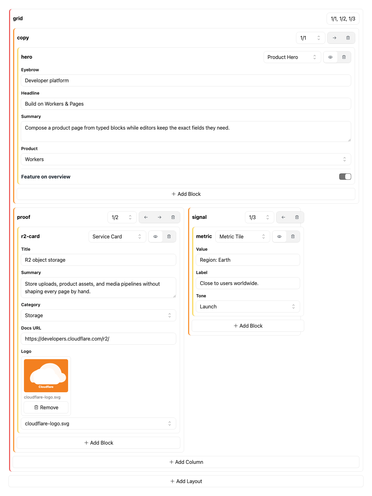

# @bnomei/emdash-bento

[](https://www.npmjs.com/package/@bnomei/emdash-bento)
[](https://www.npmjs.com/package/@bnomei/emdash-bento)
[](https://www.npmjs.com/package/@bnomei/emdash-bento)
[](./package.json)
[](https://github.com/bnomei/emdash-bento)

Bento grid field widget for EmDash JSON fields.

`@bnomei/emdash-bento` is a native EmDash plugin for row and
column layout data stored as plain JSON. It registers the `bento:layouts`
admin widget, reuses `@bnomei/emdash-blocks` for nested column content,
and exports helpers for Astro renderers to prepare visible rows and translate
fractional spans into a 12-column grid. Use it when editors need controlled
layout composition while templates still own the frontend markup.

## What It Provides

- Native EmDash plugin factory: `bentoPlugin()`.
- JSON field widget: `bento:layouts`.
- One editable layout pattern string per row.
- Nested block controls through `options.blockDefinitions`.
- Admin UI built with [Kumo UI](https://kumo-ui.com/) with full light and dark
  mode support.
- Frontend helpers: `visibleLayoutRows()` and `spanToGridColumns()`.

## Install

```sh
npm install @bnomei/emdash-bento @bnomei/emdash-blocks
```

Register both plugins in `astro.config.mjs`:

```js
import emdash from "emdash/astro";
import { bentoPlugin } from "@bnomei/emdash-bento";
import { blockBuilderPlugin } from "@bnomei/emdash-blocks";

export default {
  integrations: [
    emdash({
      plugins: [blockBuilderPlugin(), bentoPlugin()],
    }),
  ],
};
```

## Field Widget

Use the widget on an EmDash `json` field:

```json
{
  "slug": "layouts",
  "label": "Grid",
  "type": "json",
  "widget": "bento:layouts",
  "options": {
    "blockDefinitions": [
      {
        "type": "heading",
        "label": "Heading",
        "props": [{ "key": "text", "label": "Text", "type": "text" }]
      },
      {
        "type": "text",
        "label": "Text",
        "props": [{ "key": "text", "label": "Text", "type": "markdown" }]
      },
      {
        "type": "image",
        "label": "Image",
        "props": [{ "key": "image", "label": "Image", "type": "media" }]
      }
    ]
  }
}
```

## Stored Value

```ts
type LayoutBuilderValue = Array<{
  id: string;
  layout: string;
  settings?: Record<string, unknown>;
  columns: Array<{
    id: string;
    span: string;
    blocks: BlockBuilderValue;
  }>;
}>;
```

Empty layout fields stay empty when the admin widget mounts, so opening an
untouched entry does not write a default row or mark the field dirty. The widget
shows an empty state with the Add Layout button, and clicking that button creates
the first editable row.

Each row stores exactly one `layout` pattern. The pattern is a comma-separated
list of column spans, for example `1/1`, `1/2, 1/2`, or `1/1, 1/3, 2/3`.
Editing the pattern updates the row's columns by position, preserving existing
column blocks where a matching column index still exists. If the edited pattern
has fewer spans than the row already has columns, columns beyond that pattern
are removed. The per-column `span` values mirror the row pattern and are stored
so frontend renderers can read the same data directly.

Editors can also append a column with the row-level Add Column button. New
columns start as `1/1`, and the row pattern updates to match the visible
columns.

The Add Layout button creates a new row with `1/1, 1/2, 1/3`; editors can
change that row's layout pattern after it has been added.

Each column header also exposes a sorted width select and a remove button. The
select choices are the unique spans in that row's current layout pattern.
Layouts can be reordered with up/down controls. Columns can be reordered with
left/right controls.

The admin widget renders columns on a 12-column CSS grid where `1/2` spans 6 grid columns and `1/3` spans 4 columns. If a row's widths add up to more than `1/1`, the extra columns wrap to the next line. The widget accepts comma-separated fractions with denominators up to twelfths, so editors can type one row pattern such as `1/1`, `1/2, 1/2`, or `1/1, 2/3, 1/3` and override it whenever the layout needs to change.

Nested blocks use `@bnomei/emdash-blocks` directly. Pass
`options.blockDefinitions` to control the available nested block types and their
typed prop controls. Standalone block fields and layout column blocks share the
same definition shape.

## Frontend Rendering

Render layout rows as a 12-column CSS grid. The package exports helpers for the
common data preparation and span calculation:

```ts
import { spanToGridColumns, visibleLayoutRows } from "@bnomei/emdash-bento";
import { visibleBlocks } from "@bnomei/emdash-blocks";

const rows = visibleLayoutRows(entry.layouts);
```

```astro
{
  rows.map((row) => (
    <section class="layout" data-layout-id={row.id}>
      {row.columns.map((column) => (
        <div
          class="column"
          style={`--span: ${spanToGridColumns(column.span)}`}
          data-column-id={column.id}
        >
          {visibleBlocks(column.blocks).map((block) => renderBlock(block))}
        </div>
      ))}
    </section>
  ))
}
```

```css
.layout {
  display: grid;
  grid-template-columns: repeat(12, minmax(0, 1fr));
}

.column {
  grid-column: span var(--span) / span var(--span);
}
```

The helpers accept native Bento values. Migration from other systems should
happen before values are saved into EmDash.

## Package Surface

- ESM entry: `@bnomei/emdash-bento`.
- Admin entry: `@bnomei/emdash-bento/admin`.
- Type declarations are included from `dist/`.
- Peer dependencies: `@bnomei/emdash-blocks` `^0.1.0`, `emdash`
  `>=0.17.0`, `react` `^18.0.0 || ^19.0.0`, `react-dom`
  `^18.0.0 || ^19.0.0`, `@cloudflare/kumo` `^2.5.0`, and
  `@phosphor-icons/react` `^2.1.10`.

## Status

This package ships as a native EmDash plugin because the editor is a trusted React admin field widget. Package exports point at Viteplus `vp pack`-built `dist/` JavaScript and declarations; use `npm run build` for the production pack and `npm run pack:check` for the publint-verified pack check.

## Related Packages

- `@bnomei/emdash-blocks` provides the nested block editor used by Bento
  columns.
- `@bnomei/emdash-fields` provides smaller JSON-backed field widgets.

## License

MIT.

## Screenshot


